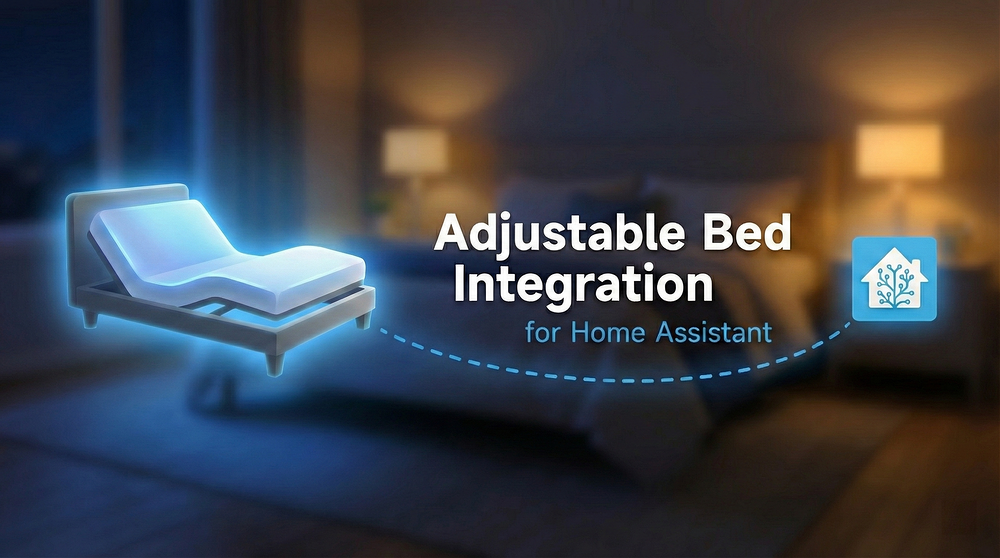

<p align="center">
  
</p>

<p align="center">
  <a href="https://github.com/kristofferR/ha-adjustable-bed/releases"></a>
  <a href="https://github.com/kristofferR/ha-adjustable-bed/actions/workflows/validate.yml"></a>
  <a href="https://github.com/hacs/integration"></a>
  
  <a href="LICENSE"></a>
</p>

<p align="center">
  A Home Assistant custom integration for controlling smart adjustable beds via Bluetooth.
</p>

## Quick Start

1. **Install** via [HACS](https://hacs.xyz): Search for "Adjustable Bed" and install
2. **Discover** your bed automatically, or add manually via Settings → Integrations
3. **Control** your bed from Home Assistant dashboards, automations, and voice assistants!

## Features

- **Motor Control** - Raise/lower head, back, legs, and feet
- **Memory Presets** - Jump to saved positions with one tap
- **Under-bed Lights** - Toggle lights on supported beds
- **Massage Control** - Adjust massage intensity and patterns
- **Position Feedback** - See current angles on supported beds
- **Automations** - "Flat when leaving", "TV mode at 8pm", etc.

## Need Help?

| Guide | What's Inside |
|-------|---------------|
| **[Troubleshooting](docs/TROUBLESHOOTING.md)** | Connection issues, commands not working |
| **[Getting Help](docs/GETTING_HELP.md)** | Bug reports, support requests, diagnostics |
| **[Connection Guide](docs/CONNECTION_GUIDE.md)** | ESPHome proxy setup, finding your bed's address |
| **[Supported Actuators](docs/SUPPORTED_ACTUATORS.md)** | Protocol details, bed brand lookup |

| | |
|---|---|
| 💬 **[Ask a Question](https://github.com/kristofferR/ha-adjustable-bed/discussions/new?category=q-a)** | Get help from the community |
| 💡 **[Suggest an Idea](https://github.com/kristofferR/ha-adjustable-bed/discussions/new?category=ideas)** | Feature requests and improvements |
| ❤️ **[Praise and Feedback](https://github.com/kristofferR/ha-adjustable-bed/discussions/131)** | Share your experience or say thanks |

<details>
<summary><b>Quick troubleshooting</b></summary>

1. **Check range** - Bluetooth adapter or proxy within ~10m of bed
2. **Disconnect other apps** - Most beds allow only one BLE connection
3. **Reload integration** - Settings → Devices & Services → Adjustable Bed → Reload
4. **Enable debug logs** - Add to `configuration.yaml`:
   ```yaml
   logger:
     logs:
       custom_components.adjustable_bed: debug
   ```

</details>

## Supported Beds

The names below refer to motor/actuator manufacturers. Your bed might use one of these internally - check the [Supported Actuators guide](docs/SUPPORTED_ACTUATORS.md) to find your bed brand.

| Actuator | Example Brands |
|----------|----------------|
| ✅ [Linak](docs/beds/linak.md) | Tempur-Pedic, Bedre Nætter, Jensen |
| ✅ [Keeson](docs/beds/keeson.md) | Member's Mark, Purple, GhostBed, ErgoSportive |
| ✅ [Richmat](docs/beds/richmat.md) | Casper, MLILY, Sven & Son, Avocado, Luuna, Jerome's |
| ✅ [MotoSleep](docs/beds/motosleep.md) | HHC, Power Bob |
| ✅ [Octo](docs/beds/octo.md) | Octo |
| ✅ [Solace](docs/beds/solace.md) | Solace |
| ✅ [Leggett & Platt](docs/beds/leggett-platt.md) | Leggett & Platt |
| ✅ [Reverie](docs/beds/reverie.md) | Reverie |
| ✅ [Okimat/Okin](docs/beds/okimat.md) | Lucid, CVB, Smartbed |
| ✅ [Ergomotion](docs/beds/ergomotion.md) | Serta, Tempur, Beautyrest, King Koil |
| ✅ [Jiecang](docs/beds/jiecang.md) | Glideaway, Dream Motion |
| ✅ [DewertOkin](docs/beds/dewertokin.md) | Rize, Simmons, Nectar, Resident, Symphony |
| ✅ [Serta](docs/beds/serta.md) | Serta Motion Perfect |
| ✅ [Mattress Firm 900](docs/beds/mattressfirm.md) | Mattress Firm, iFlex |
| ✅ [Nectar](docs/beds/nectar.md) | Nectar |
| ✅ [Malouf](docs/beds/malouf.md) | Malouf, Structures |

**Have one of these?** [Let us know](https://github.com/kristofferR/ha-adjustable-bed/issues) how well it works!

## Will This Work With My Bed?

**Just try it!** The integration auto-detects most beds. Install it and see if your bed shows up.

**Didn't auto-detect?** Check the [Supported Actuators guide](docs/SUPPORTED_ACTUATORS.md) to find your bed's actuator brand, then add it manually.

**Still stuck?** [Open an issue](https://github.com/kristofferR/ha-adjustable-bed/issues) with your bed brand/model and we'll help!

**Other beds:** [Eight Sleep](https://github.com/lukas-clarke/eight_sleep) and [Sleep Number](https://www.home-assistant.io/integrations/sleepiq/) have their own integrations. Cloud-based beds (Tempur Ergo, BeautyRest with Sleeptracker AI) aren't supported yet.

## Installation

### HACS (Recommended)

1. Open HACS in Home Assistant
2. Search for "Adjustable Bed"
3. Click Install
4. Restart Home Assistant

### Manual

Copy `custom_components/adjustable_bed` to your `config/custom_components/` directory and restart.

## Configuration

Your bed should auto-discover via Bluetooth. If not:

1. Go to **Settings** → **Devices & Services** → **Add Integration**
2. Search for "Adjustable Bed"
3. Enter your bed's Bluetooth address or select from discovered devices

To adjust settings after setup, click the **gear icon** on your device in Settings → Devices & Services.

<details>
<summary><b>Quick reference</b></summary>

| Setting | Description |
|---------|-------------|
| Motor Count | 2 (back/legs), 3 (adds head), or 4 (adds feet) |
| Has Massage | Enable if your bed has massage |
| Protocol Variant | Usually auto-detected, override if needed |
| Motor Pulse Settings | Fine-tune movement timing |
| Disable Angle Sensing | Keep on to allow physical remote to work |
| Octo PIN | 4-digit PIN for Octo beds that require authentication |
| Richmat Remote | Remote model code for Richmat beds |

See the [Configuration Guide](docs/CONFIGURATION.md) for all options.

</details>

## Bluetooth Setup

Works with Home Assistant's native Bluetooth:
- **Local adapter** on your HA host
- **[ESPHome Bluetooth Proxy](https://esphome.io/components/bluetooth_proxy.html)** for extended range

See the [Connection Guide](docs/CONNECTION_GUIDE.md) for setup help.

## Contributing

**We'd love your help!** This integration is actively developed and we're especially looking for:

- **Testers** - Own a bed we haven't fully tested? Your feedback is invaluable
- **Bug reports** - Found something wrong? [Open an issue](https://github.com/kristofferR/ha-adjustable-bed/issues)
- **Code contributions** - PRs welcome!

<details>
<summary><b>Adding support for a new bed type</b></summary>

1. Capture BLE traffic using nRF Connect or similar
2. Document the GATT services and characteristics
3. Implement a controller in `beds/`
4. Add detection to `config_flow.py`

See [Supported Actuators](docs/SUPPORTED_ACTUATORS.md) for protocol documentation.

</details>

## Credits

Massive thanks to the [smartbed-mqtt](https://github.com/richardhopton/smartbed-mqtt) developers for their pioneering work reverse-engineering bed protocols!

<details>
<summary><b>Migrating from smartbed-mqtt?</b></summary>

This integration replaces smartbed-mqtt with several advantages:
- Uses Home Assistant's native Bluetooth (no ESPHome API issues)
- Works seamlessly with ESPHome Bluetooth proxies
- No MQTT broker required
- Native HA entities

To migrate: Install this integration, configure your bed, verify it works, then remove smartbed-mqtt.

</details>

## License

MIT License - see [LICENSE](LICENSE) for details.
